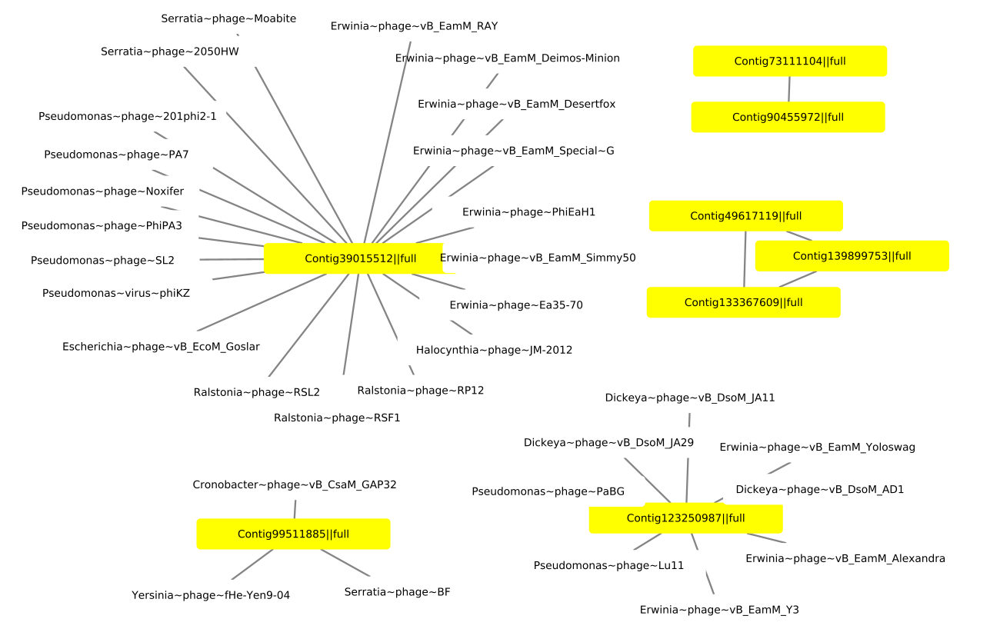

# Overview

This report is an analysis of the Barre Woods filter metagenomes from
the combined assembly Assembly, binning, quality control and
classification was done on KBase
(<https://narrative.kbase.us/narrative/145971>. The checkv and virsorter
files were downloaded to this project folder.

```{r}
# Load libraries
library(tidyverse)
library(DT)
```

## virsorter2 and vcheck

### Data processing

virsorter2 identifies dsDNAphages, NCLDV, ssDNA, virophages and some rna
viruses in contigs. An 0.8 cutoff score is commonly used to remove
potential false positives. checkv assesses the quality of contigs.

```{r}
virsorter <- read_tsv("data_combined_assembly/virsorter-final-viral-score.tsv") %>% 
  filter(max_score_group == "dsDNAphage") %>% 
  select(-c(dsDNAphage, ssDNA, NCLDV, lavidaviridae)) %>% 
  rename("contig_id" = "seqname")

checkv <- read_tsv("data_combined_assembly/checkv_quality_summary.tsv") 
```

#### Join checkv and virsorter dataframes

```{r}
virsorter_checkv <- left_join(virsorter, checkv, by = "contig_id")
```

#### filter to high quality and complete genomes

```{r}
virsorter_checkv_HQ <- virsorter_checkv %>% 
  filter(checkv_quality == "Complete" | checkv_quality == "High-quality")
```

#### filter to HQ jumbo phages

```{r}
virsorter_checkv_jumbo <- virsorter_checkv %>% 
  filter(checkv_quality == "Complete" | checkv_quality == "High-quality") %>% 
  filter(length >= 200000)
```

#### Write files

```{r, eval=FALSE}
# write summary file
write_tsv(virsorter_checkv, "data_combined_assembly/coa-virsorter_checkv.tsv") 
write_tsv(virsorter_checkv_HQ, "data_combined_assembly/coa-virsorter_checkv_HQ.tsv") 
write_tsv(virsorter_checkv_jumbo, "data_combined_assembly/coa-virsorter_checkv_jumbo.tsv") 
```

### Data analysis

#### Barchart of checkv_quality

```{r}
virsorter_checkv %>% 
ggplot(aes(x = checkv_quality)) + 
  geom_bar() 
```

#### Table with % checkv_quality in each category

```{r}
virsorter_checkv %>% 
  mutate(across(checkv_quality, as_factor)) %>% 
  group_by(checkv_quality) %>% 
  summarise(n = n()) %>%
  mutate(freq = n / sum(n))
```

#### Histogram of all contigs

Most low quality contigs are less than 20kb

```{r}
virsorter_checkv %>% 
ggplot(aes(x = length, fill = checkv_quality)) + 
  geom_histogram(colour = "black",  binwidth=10000) +
  ggtitle("Genome size of Phage") +
  xlab("Genome size") + 
  theme(text = element_text(size = 20, color="black"))
  theme(axis.text.x = element_text(angle = 90)) 
```

#### Histogram of HQ contigs

```{r}
virsorter_checkv_HQ %>% 
ggplot(aes(x = length, fill = checkv_quality)) + 
  geom_histogram(colour = "black",  binwidth=10000) +
  ggtitle("Genome size of Phage") +
  xlab("Genome size") + 
  #theme(text = element_text(size = 20, color="black"))
  theme(axis.text.x = element_text(angle = 45)) 
```


## Merging GTDB and binning data with virsorter2 and vcheck

```{r}
# read metabat files to get each contig and gtdb file
metabat <- read_tsv("data_combined_assembly/metabat_depth_contigs.tsv") 
checkm_gtdb <- read_tsv("data_combined_assembly/checkm_gtdb_NEB_coassembly_2.5k.tsv") %>% 
  select(-c(`Marker Lineage`,	`# Genomes`,	`# Markers`,	`# Marker Sets`, `0`,	`1`,	`2`,	`3`,	`4`,	`5`, `user_genome`))
```

```{r}
# split contig name based on ||
virsorter_checkv_contig <- virsorter_checkv %>% 
   separate(`contig_id`, c("contig_id", "full-partial"), "\\|\\|") 
# join with metabat
virsorter_checkv_contig_metabat <- left_join(virsorter_checkv_contig, metabat, by = c("contig_id" = "seqname"))
# join with checkm_gtdb
virsorter_checkv_contig_metabat_checkm_gtdb <- left_join(virsorter_checkv_contig_metabat, checkm_gtdb, by = c("bin"))
```

### contigs that mapped to HQ and MQ bins

```{r}
virsorter_checkv_contig_metabat_checkm_gtdb_MQ <- virsorter_checkv_contig_metabat_checkm_gtdb %>% 
  filter(Completeness > 50) %>% 
  filter(Contamination < 10) 

virsorter_checkv_contig_metabat_checkm_gtdb_noMQ <- virsorter_checkv_contig_metabat_checkm_gtdb %>% 
  filter(Completeness < 50) 
```


## vContact

vContact groups contigs into clusters along with phages in NCBI's viurs
reference database \### data processing

#### read in files

```{r}
vcontact <- read_csv("data_combined_assembly/vcontact_genome_by_genome_overview.csv") 
vcontact_ntw <- read_table("data_combined_assembly/coa-vcontact_c1.ntw", col_names = FALSE) 
```

#### join with virsorter and checkv results

```{r}
virsorter_checkv_HQ_vcontact <- left_join(virsorter_checkv_HQ, vcontact, by = c("contig_id" = "Genome"))
virsorter_checkv_jumbo_vcontact <- left_join(virsorter_checkv_jumbo, vcontact, by = c("contig_id" = "Genome"))
```

#### filter network files to contain just HQ or jumbo phages for cytoscape

```{r}
# make a vector of HQ and jumbo contigs
HQ_contigs <- pull(virsorter_checkv_HQ, contig_id)
jumbo_contigs <- pull(virsorter_checkv_jumbo_vcontact, contig_id)  

# create list of low quality genomes
# There are genes in the vcontact network that are not in the merged virsorter/vcheck file
# So first make a list of vcontact genomes with contig in name then filter HQ

vcontact_contig_LQ <- vcontact %>% 
filter(grepl('Contig', Genome)) %>% 
filter(!Genome %in% HQ_contigs)

# make a vector of low quality contigs 
LQ_contigs <- pull(vcontact_contig_LQ, Genome)  

# filter vcontact network based on HQ genomes}
vcontact_ntw_HQ <- vcontact_ntw %>% 
filter(X1 %in% HQ_contigs) %>% 
filter(!X1 %in% LQ_contigs & !X2 %in% LQ_contigs)

# filter vcontact network based on jumbo genomes
vcontact_ntw_jumbo <- vcontact_ntw %>% 
filter(X1 %in% jumbo_contigs) %>% 
filter(!X1 %in% LQ_contigs & !X2 %in% LQ_contigs)

# filter vcontact network based on jumbo genomes and interaction score <30
vcontact_ntw_jumbo30 <- vcontact_ntw_jumbo %>% 
  filter(X3 > 30)
```

#### Write files

```{r, eval=FALSE}
write_tsv(virsorter_checkv_HQ_vcontact, "data_combined_assembly/coa-virsorter_checkv_HQ_vcontact.tsv") 
write_tsv(virsorter_checkv_jumbo_vcontact,"data_combined_assembly/coa-virsorter_checkv_jumbo_vcontact.tsv") 
write.table(vcontact_ntw_HQ, "data_combined_assembly/vcontact_ntw_HQ.ntw", sep = " ", col.names=F, row.names=F, quote=F)
write.table(vcontact_ntw_jumbo, "data_combined_assembly/vcontact_ntw_jumbo.ntw", sep = " ", col.names=F, row.names=F, quote=F)
write.table(vcontact_ntw_jumbo30, "data_combined_assembly/vcontact_ntw_jumbo30.ntw", sep = " ", col.names=F, row.names=F, quote=F)
```

### Data Analysis

#### Histogram of interaction score

```{r}
vcontact_ntw_jumbo %>% 
ggplot(aes(x = X3)) + 
  geom_histogram(colour = "black",  binwidth=10) +
  xlab("Score") + 
  #theme(text = element_text(size = 20, color="black"))
  theme(axis.text.x = element_text(angle = 45)) 
```

## Cytoscape

### Notes

#### To load network

File \> Import\> Network from file Open Advanced options Select
delimiter = space deselect use first column as names select col 1 as
source select col 2 as target select col 3 as edge

#### To select a group of nodes

shift then mouse drag

### Data Analysis

#### Jumbo30 network



## DRAMv

### Data processing

#### Read files AMG summary and stats files

```{r}
DRAMv_amg <- read_tsv("data_combined_assembly/DRAMv_amg_summary.tsv") %>% 
  rename("contig_id" = "scaffold")
DRAMv_stats <- read_tsv("data_combined_assembly/DRAMv_vMAG_stats.tsv") %>% 
  rename("contig_id" = "...1")
```

#### join with stats virsorter and checkv results

```{r}
DRAMv_stats_virsorter_checkv_HQ <- left_join(virsorter_checkv_HQ, DRAMv_stats, by = "contig_id")
DRAMv_stats_virsorter_checkv_jumbo <- left_join(virsorter_checkv_jumbo, DRAMv_stats, by = "contig_id")
```

#### Add annotation to tibble with AMG names

```{r}
DRAMv_amg_virsorter_checkv <- left_join(DRAMv_amg, virsorter_checkv, by = "contig_id")
```

#### filter amd files to HQ and jumbo

```{r}
DRAMv_amg_virsorter_checkv_HQ <- DRAMv_amg_virsorter_checkv %>% 
filter(contig_id %in% HQ_contigs)

DRAMv_amg_virsorter_checkv_jumbo <- DRAMv_amg_virsorter_checkv %>% 
filter(contig_id %in% jumbo_contigs)
```

#### Write files

```{r}
write_tsv(DRAMv_stats_virsorter_checkv_HQ, "data_combined_assembly/coa-DRAMv_stats_virsorter_checkv_HQ .tsv") 
write_tsv(DRAMv_stats_virsorter_checkv_jumbo,"data_combined_assembly/coa-DRAMv_stats_virsorter_checkv_jumbo.tsv") 
write_tsv(DRAMv_amg_virsorter_checkv_HQ, "data_combined_assembly/coa-DRAMv_amg_virsorter_checkv_HQ.tsv") 
write_tsv(DRAMv_amg_virsorter_checkv_jumbo,"data_combined_assembly/coa-DRAMv_amg_virsorter_checkv_jumbo.tsv") 
```

### Data Analysis

#### Graph of genes vs amgs in HQ

```{r}
DRAMv_stats_virsorter_checkv_HQ %>% 
ggplot(aes(x = `Gene count`, y = `potential AMG count`)) + 
  geom_point() 
```

#### Graph of genes vs amgs in HQ no provirus

```{r}
DRAMv_stats_virsorter_checkv_HQ %>% 
  filter(provirus == "No") %>% 
ggplot(aes(x = `Gene count`, y = `potential AMG count`)) + 
  geom_point() 
```

#### Graph of genes vs iral genes with host benefits in HQ no provirus

```{r}
DRAMv_stats_virsorter_checkv_HQ %>% 
  filter(provirus == "No") %>% 
ggplot(aes(x = `Gene count`, y = `Viral genes with host benefits`)) + 
  geom_point() 
```

#### Genome length vs gene count

```{r}
DRAMv_stats_virsorter_checkv_HQ %>% 
    filter(provirus == "No") %>% 
ggplot(aes(x = `length`, y = `Gene count`)) + 
  geom_point()
```

#### HQ contigs with transposes

```{r}
DRAMv_stats_virsorter_checkv_HQ %>% 
    filter(provirus == "No") %>% 
ggplot(aes(x = `length`, y = `Gene count`)) + 
  geom_point(aes(colour = `Transposase present`))
```

#### tRNA count per genome

## virmatcher

### Data Processing

#### Join the virmatcher results csv with the virsorter_checkv_HQ and checkM_GTDB files to get virus and bacteria annotation

```{r}
virmatch <- read_csv("data_combined_assembly/coa-virmatcher.csv") %>% 
  rename("contig_id" = "Original Viral population") %>% 
  rename("bin" = "Original Host")

checkm_gtdb <- read_tsv("data_combined_assembly/checkm_gtdb_NEB_coassembly_2.5k.tsv") 

detect_viral_bins_final_calls <- read_tsv("data_combined_assembly/detect_viral_bins_final_calls.tsv") 
```

#### Remove proviruses and low quality bins

```{r}
virsorter_checkv_HQ_virmatch <- left_join(virsorter_checkv_HQ, virmatch, by = "contig_id") 
virsorter_checkv_HQ_virmatch_checkm_gtdb <- left_join(virsorter_checkv_HQ_virmatch, checkm_gtdb, by = "bin") %>% 
  filter(Completeness > 50) %>% 
  filter(Contamination < 10)
```

Should check to see if any HQ phage are in bins which would complicate
results. Find bin associated with contig

```{r}
### to map contigs to bins
metabat_bins_contigs <- read_tsv("data_combined_assembly/metabat_depth_contigs.tsv") %>% 
  rename("contig_id" = "seqname") %>% 
  select(-c(contigLen, totalAvgDepth, `contig_%GC`)) 
virsorter_checkv_HQ_virmatch_checkm_gtdb$contig_id <- str_replace_all(virsorter_checkv_HQ_virmatch_checkm_gtdb$contig_id, "full", "")
virsorter_checkv_HQ_virmatch_checkm_gtdb$contig_id <- str_replace_all(virsorter_checkv_HQ_virmatch_checkm_gtdb$contig_id, "[[|]]", "")

virsorter_checkv_HQ_virmatch_checkm_gtdb_bin <- left_join(virsorter_checkv_HQ_virmatch_checkm_gtdb, metabat_bins_contigs, by = "contig_id")
write_tsv(virsorter_checkv_HQ_virmatch_checkm_gtdb_bin, "data_combined_assembly/virsorter_checkv_HQ_virmatch_checkm_gtdb_bin.tsv") 
```

Genetic exchange shapes ultra-small Patescibacteria metabolic capacities
in the terrestrial subsurface
<https://www.biorxiv.org/content/10.1101/2022.10.05.510940v2.full>

From MAGs to riches: exploring the microbial community of activated
sludge using high-quality MAGS
<https://www.youtube.com/watch?v=EzIN7ycK6-E> They also identified 38
reduced-genome bacteria and archaea, including one Paceibacteria genome:
an exciting find, as organisms from this group had not previously been
characterised in situ. Using the 16S sequences, they were able to design
FISH probes and visualise the bacterium; assembly of the genome also
identified versions with and without an additional fragment which was
revealed to represent a pha

<https://journals.plos.org/plosbiology/article?id=10.1371/journal.pbio.3002083>
